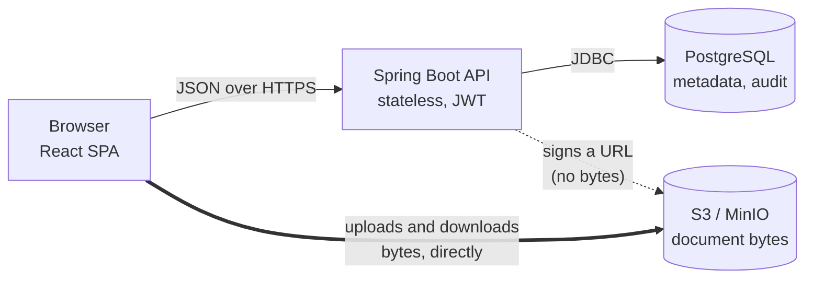
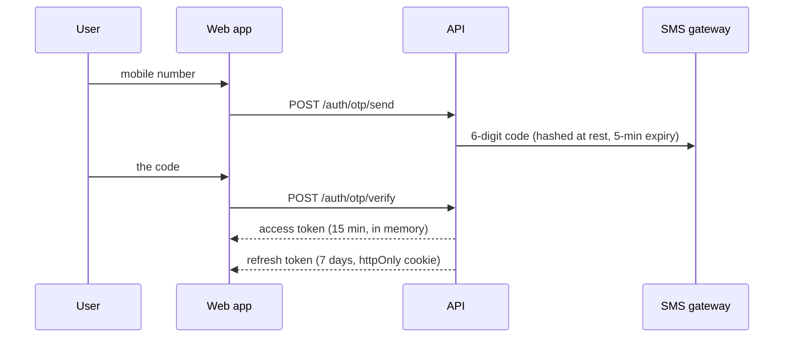
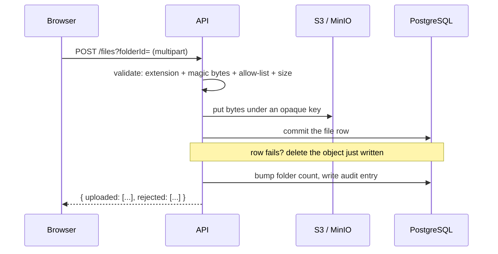
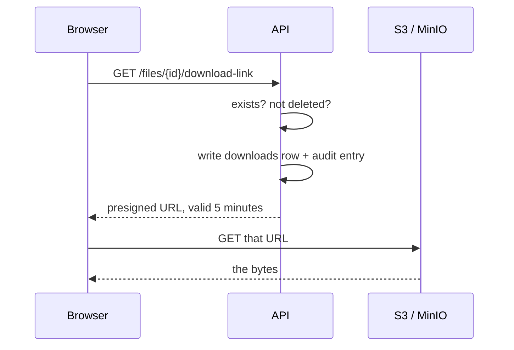
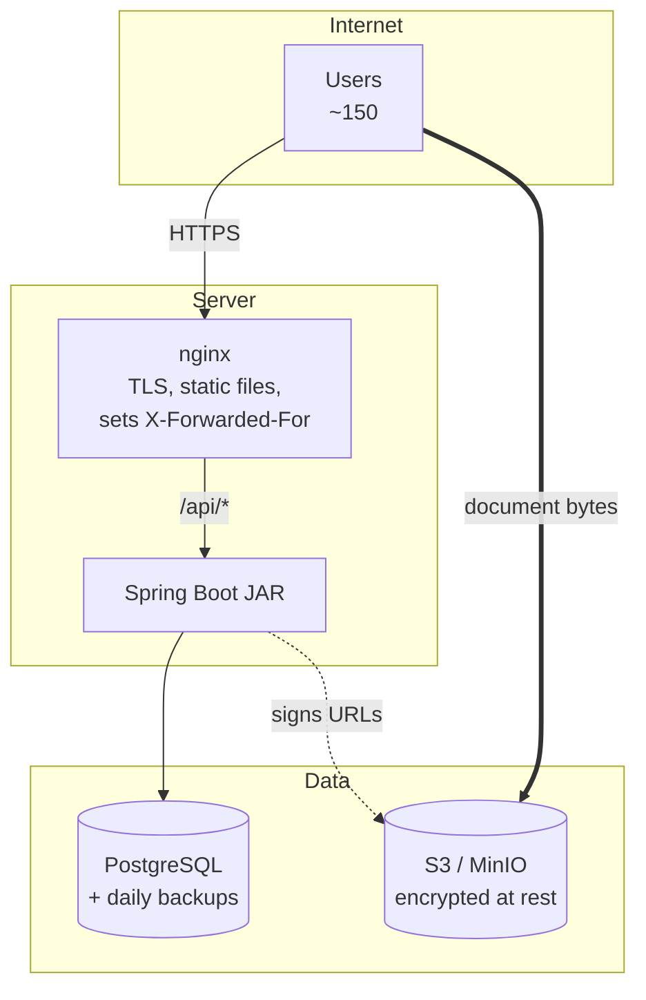

# Architecture — ALLGOSANDCOURTCOPYS

How the system is put together, and why. Written for a developer joining the project and for the
client's IT staff assessing it before hosting sign-off.

- [HANDOFF.md](HANDOFF.md) is the orientation — the four rules and what exists today.
- [IMPLEMENTATION_PLAN.md](IMPLEMENTATION_PLAN.md) is the contract with the client.

---

## 1. The shape of it

Four parts. The one thing worth understanding before anything else: **document bytes never pass
through the application server.**



The API decides *who may do what* and hands out short-lived signed links. The file transfer itself
happens between the browser and object storage.

That single decision explains most of the rest: download throughput is object storage's problem
rather than the server's, a leaked link expires in minutes, and the application can be a small VM
even when the archive is large.

---

## 2. What lives where

### PostgreSQL — everything except the files

| Table | Holds |
|---|---|
| `users` | Accounts. Mobile number is the identity; password is a BCrypt hash |
| `registration_requests` | The admin approval queue — one row per self-registration |
| `departments` | The 43 departments, seeded by migration |
| `folders` | Nested filing structure, with a `category` and a denormalised `file_count` |
| `files` | Name, type, size, uploader, version, `is_deleted`, and **`storage_key`** — the pointer into object storage |
| `file_deletions` | Who deleted what, **and the reason they gave** |
| `downloads` | One row each time a user is handed a download link |
| `favorites` | Private per user; unique on `(user_id, file_id)` |
| `notifications` | Approvals, rejections, deletions, restores |
| `audit_logs` | Append-only record of every action, with JSONB metadata |
| `otp_verifications` | Hashed codes, expiry, attempt and send counts |

Flyway owns the schema; Hibernate is `validate` only and never writes DDL. Three migrations, and
none has changed since Phase 1 — later phases only started using tables that were already there.

### S3 / MinIO — only the bytes

Every object is stored under an opaque key:

```
{departmentId}/{folderId}/{uuid}.pdf
```

Nothing from the uploaded filename appears in the key, so no one can guess another department's
objects from knowing what a document is called. The extension is kept only so a downloaded file
opens in the right application.

**The bucket is never publicly readable.** Every read is a presigned URL valid for five minutes.

---

## 3. How a request works

### Signing in



Three rules are enforced here and cannot be bypassed by any client:

1. **A token is issued only to an approved, ACTIVE account.** Pending, rejected and disabled
   accounts are refused by both sign-in paths.
2. **The first sign-in of each calendar day must be an OTP.** Afterwards a password works until
   midnight. The date comes from the server clock in Asia/Kolkata, so nothing the client sends can
   skip it.
3. **The access token lives in memory only**, never in localStorage, so a cross-site scripting bug
   cannot read it. Continuity across a page reload comes from the httpOnly refresh cookie.

Every request re-reads the user row rather than trusting the token, so disabling an account takes
effect on the very next call instead of when the token happens to expire.

### Uploading a document



**Validation happens before a single byte is stored.** The declared content type decides nothing —
Tika reads the actual signature, and the extension, the signature and the configured allow-list must
all agree. A `.pdf` beginning with `MZ` is refused as `FILE_CONTENT_MISMATCH`. Filenames are rebuilt
from their last path segment, so `../../etc/passwd` becomes `passwd`.

**Bytes are written before the database row, deliberately.** Object storage cannot join a database
transaction, so one of two failure modes had to be chosen:

| Order | Failure leaves |
|---|---|
| **Bytes first** (chosen) | An orphaned object — invisible to users, removable by a sweep |
| Row first | A row whose document cannot be downloaded — visible, and much worse |

**One bad file does not fail the batch.** The response carries `uploaded` and `rejected` lists, so
seven good documents survive the eighth being an executable.

Limits: 50 MB per file, 200 MB per request. Allowed: PDF, JPEG, PNG, TIFF, Word, Excel.

### Downloading and previewing



Preview is **the same call with one argument different**. `presignedGet(key, ttl, filename)` attaches
a `Content-Disposition: attachment` header when given a filename and omits it when passed null.
Attachment saves to disk; no disposition renders in the page. That argument is the entire difference
between the two features.

Previewing writes an audit entry but **no `downloads` row** — the download history answers "who has
a copy of this", and counting glances would make it meaningless.

### Deleting and restoring

Deletes are **soft**, and the reason is not a formality:

1. A blank reason is refused — twice, by bean validation and again in the service
2. Only the uploader or an admin may delete, re-read from the stored row rather than trusted from
   the request
3. `is_deleted` is set; **the bytes stay**, which is what makes restore possible
4. A `file_deletions` row records who and why
5. **Every admin is notified, with that reason in the body**

A deleted document disappears from browsing, search and favourites, but its row stays in each user's
download history marked unavailable — a history that dropped entries would not be a history.

---

## 4. The security model

**Admin approval is the only access gate.** There is no per-folder permission table, no access-type
flag, no per-user download toggle. Once approved, every member can view, download and upload in
**any** department — including ones they do not belong to. That is deliberate and replaced an
earlier, stricter model.

| Concern | How |
|---|---|
| Authentication | JWT, HMAC-SHA384. Access 15 min, refresh 7 days in an httpOnly `SameSite=Strict` cookie |
| Session revocation | `token_version` on the user row; "sign out everywhere" and password changes increment it, invalidating every issued token at once |
| Authorization | `@PreAuthorize("hasRole('ADMIN')")` on the **class** of each admin controller, so a new endpoint cannot be left unguarded |
| Ownership | Delete and replace re-check against the stored row; a member cannot touch another's document by guessing an id |
| Brute force — per account | OTP: 6 digits, hashed, 5-min expiry, 5 attempts, single-use, 45-second resend cooldown, 5 sends/hour. Passwords: BCrypt with lockout |
| Brute force — per caller | 60 requests/minute per address to `/auth/**`, ahead of any password work |
| Transport | TLS terminated at the reverse proxy; HSTS, CSP, Referrer-Policy and Permissions-Policy on every response |
| Document access | Never public. Presigned URLs, 5 minutes, opaque keys |
| Evidence | Every meaningful action writes an `audit_logs` row. The application has no way to edit or delete one |

Two counters are written in **separate transactions** on purpose: failed OTP attempts and failed
password attempts. The exception that rejects the request would otherwise roll back the increment,
leaving OTP guessing effectively unlimited.

**Production start-up refuses development defaults.** Under the `prod` profile the application will
not start with the placeholder JWT secret, MinIO's default credentials, a localhost CORS origin, a
disabled rate limiter or the mock OTP provider. Each of those *works*, which is exactly why it would
otherwise survive a deployment unnoticed.

---

## 5. Deployment



| Development | Production |
|---|---|
| Postgres in Docker on **:5433** | Managed PostgreSQL, or one on a VM, with tested restores |
| MinIO in Docker on :9000 | AWS S3 or a MinIO cluster — the hosting decision |
| `./mvnw spring-boot:run` | The built JAR as a service behind nginx |
| Vite dev server on :5173 | `npm run build` output served as static files by nginx |
| `OTP_PROVIDER=mock` (codes printed to the log) | MSG91 or Twilio with DLT-approved templates |

The application code is identical across both — S3 and MinIO speak the same protocol, which is why
`app.storage.endpoint` is only a config value.

**Two things the reverse proxy must do:**

1. **Set `X-Forwarded-For` itself.** The rate limiter and the audit trail both read it. A proxy that
   passes a client-supplied value lets an attacker rotate it; one that sets nothing collapses every
   user onto a single address and throttles the whole office together.
2. **Terminate TLS.** HSTS is sent only over HTTPS.

Everything is configured by environment variable — see `application.yml` for the full list. The
important ones: `JWT_SECRET`, `DB_*`, `S3_*`, `CORS_ORIGINS`, `OTP_PROVIDER`, `SEED_ADMIN_MOBILE`.

**Scale.** The design assumes one application instance and roughly 150 users. The rate limiter
counts per instance, so a second instance behind a load balancer would need Redis or the proxy's own
limiter. Nothing else holds server-side state — the API is stateless, so the database and object
store are the only things that must be shared.

---

## 6. Growth and retention

Nothing in the system currently deletes anything. That is safe for now and must not stay that way.

| What grows | Rough rate | Cleaned today |
|---|---|---|
| Live documents | ~18 GB/year at 50 uploads/day × 1 MB | n/a |
| Soft-deleted documents | Bytes kept forever so restore works | **No** |
| Superseded versions | Every "Replace" keeps the old object, unreachable | **No** |
| `audit_logs` | ~750k rows/year at 150 users | **No** |
| `otp_verifications` | ~50k rows/year — useless after 5 minutes | **No** |

Three of those need a **client decision** before anything can be written: how long the activity log
must be kept, how long deleted documents stay restorable, and whether superseded versions should be
recoverable at all. Deleting court records on a schedule nobody agreed to is a worse problem than a
full disk.

Two can be done without asking anyone: purging `otp_verifications` older than a day, and sweeping
orphaned objects — taking care that a key named in a `file_replaced` audit entry is a superseded
version, not an orphan.

Operationally: put documents and the database on **separate volumes** so one cannot fill the other,
alert at 70% and 85%, and prefer the storage provider's own lifecycle rules over a job you maintain.

---

## 7. Questions the client's IT will ask

- **Where do the documents physically sit?** Wherever the hosting decision puts them. Court
  documents on a commercial cloud need written data-residency sign-off; on NIC/MeghRaj they do not.
- **Can an administrator read a user's password?** No. Only a BCrypt hash is stored.
- **Can anyone tamper with the audit trail?** Not through the application — there is no endpoint
  that edits or deletes an entry, and no repository method either. Database-level access is a
  separate control.
- **What happens if someone leaks a document link?** It stops working within five minutes.
- **Is anything encrypted at rest?** The object store should be configured for it; the database
  should use encrypted volumes. Both are deployment settings rather than application code.
- **What happens when someone leaves?** An admin sets them INACTIVE, which takes effect on their
  very next request. Their uploads and audit history remain, which is the point.
